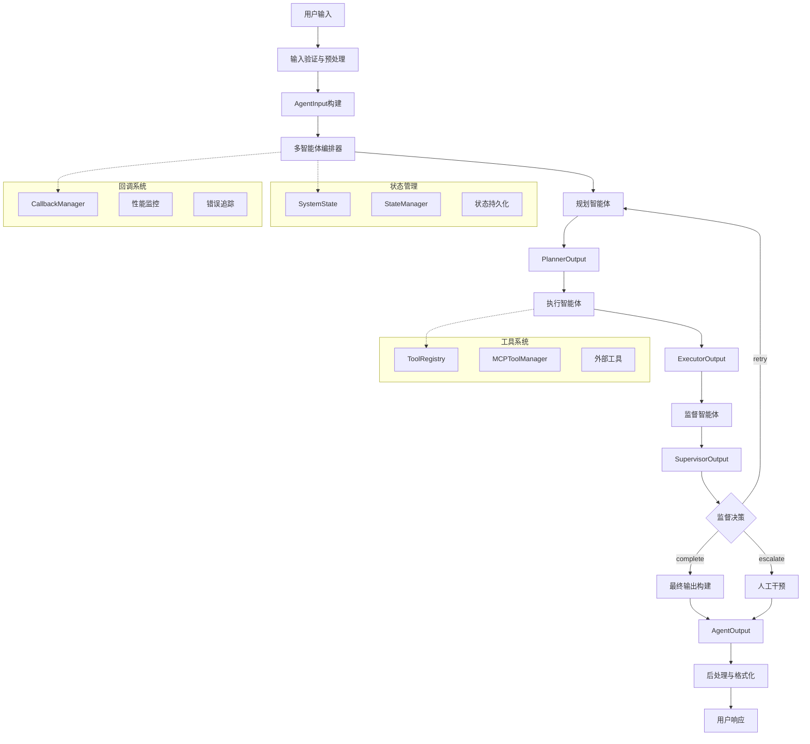

# UnifyDialog 设计方案 - 第四部分

## 4. 数据流设计与系统交互

### 4.1 核心数据结构

#### 4.1.1 输入输出数据结构

```go
// AgentInput 多智能体系统输入
type AgentInput struct {
    Query       string                 `json:"query"`                 // 用户查询
    Context     map[string]interface{} `json:"context"`              // 上下文信息
    SessionID   string                 `json:"session_id"`           // 会话ID
    UserID      string                 `json:"user_id"`              // 用户ID
    RequestID   string                 `json:"request_id"`           // 请求ID
    Priority    Priority               `json:"priority"`             // 请求优先级
    Constraints []string               `json:"constraints"`          // 执行约束
    Options     *ProcessingOptions     `json:"options,omitempty"`    // 处理选项
    Metadata    map[string]interface{} `json:"metadata"`             // 元数据
    Timestamp   time.Time              `json:"timestamp"`            // 请求时间
}

// AgentOutput 多智能体系统输出
type AgentOutput struct {
    Success      bool                   `json:"success"`              // 执行成功标志
    Response     string                 `json:"response"`             // 最终响应
    State        *SystemState           `json:"state,omitempty"`      // 系统状态
    Metadata     map[string]interface{} `json:"metadata"`             // 输出元数据
    Metrics      *ProcessingMetrics     `json:"metrics,omitempty"`    // 性能指标
    Errors       []ErrorInfo            `json:"errors,omitempty"`     // 错误信息
    Warnings     []string               `json:"warnings,omitempty"`   // 警告信息
    RequestID    string                 `json:"request_id"`           // 关联请求ID
    ProcessingTime time.Duration        `json:"processing_time"`      // 处理时间
    Timestamp    time.Time              `json:"timestamp"`            // 响应时间
}

// ProcessingOptions 处理选项
type ProcessingOptions struct {
    EnableStreaming  bool          `json:"enable_streaming"`     // 启用流式处理
    MaxExecutionTime time.Duration `json:"max_execution_time"`   // 最大执行时间
    MaxRetries       int           `json:"max_retries"`          // 最大重试次数
    EnableCheckpoint bool          `json:"enable_checkpoint"`    // 启用检查点
    CustomSettings   map[string]interface{} `json:"custom_settings"` // 自定义设置
}

// ProcessingMetrics 处理指标
type ProcessingMetrics struct {
    TotalTime       time.Duration `json:"total_time"`        // 总处理时间
    PlanningTime    time.Duration `json:"planning_time"`     // 规划时间
    ExecutionTime   time.Duration `json:"execution_time"`    // 执行时间
    SupervisionTime time.Duration `json:"supervision_time"`  // 监督时间
    ToolCallCount   int           `json:"tool_call_count"`   // 工具调用次数
    ModelCallCount  int           `json:"model_call_count"`  // 模型调用次数
    TokensUsed      int64         `json:"tokens_used"`       // 使用的Token数
    StepCount       int           `json:"step_count"`        // 执行步骤数
    RetryCount      int           `json:"retry_count"`       // 重试次数
}

// ErrorInfo 错误信息结构
type ErrorInfo struct {
    Code        string                 `json:"code"`         // 错误代码
    Message     string                 `json:"message"`      // 错误消息
    Component   string                 `json:"component"`    // 出错组件
    Timestamp   time.Time              `json:"timestamp"`    // 错误时间
    Context     map[string]interface{} `json:"context"`      // 错误上下文
    Recoverable bool                   `json:"recoverable"`  // 是否可恢复
    Suggestions []string               `json:"suggestions"`  // 修复建议
}
```

#### 4.1.2 中间数据结构

```go
// PlannerOutput 规划器输出
type PlannerOutput struct {
    Plan        *Plan                  `json:"plan"`                // 执行计划
    Analysis    *QueryAnalysis         `json:"analysis"`            // 查询分析
    Reasoning   string                 `json:"reasoning"`           // 规划推理
    Confidence  float64                `json:"confidence"`          // 置信度
    Alternatives []*Plan               `json:"alternatives"`        // 备选方案
    Metadata    map[string]interface{} `json:"metadata"`            // 元数据
}

// ExecutorOutput 执行器输出
type ExecutorOutput struct {
    Results     []StepResult           `json:"results"`             // 步骤结果
    Status      ExecutionStatus        `json:"status"`              // 执行状态
    Progress    float64                `json:"progress"`            // 执行进度 (0-1)
    CurrentStep int                    `json:"current_step"`        // 当前步骤
    Logs        []ExecutionEntry       `json:"logs"`                // 执行日志
    Artifacts   map[string]interface{} `json:"artifacts"`           // 生成的工件
    Metadata    map[string]interface{} `json:"metadata"`            // 元数据
}

// SupervisorOutput 监督器输出
type SupervisorOutput struct {
    Action      string                 `json:"action"`              // 下一步动作
    Feedback    []string               `json:"feedback"`            // 反馈信息
    Score       float64                `json:"score"`               // 质量评分
    Evaluation  *QualityEvaluation     `json:"evaluation"`          // 详细评估
    Improvements []string              `json:"improvements"`        // 改进建议
    Metadata    map[string]interface{} `json:"metadata"`            // 元数据
}

// QueryAnalysis 查询分析结果
type QueryAnalysis struct {
    Intent      string                 `json:"intent"`              // 意图识别
    Entities    []Entity               `json:"entities"`            // 实体识别
    Keywords    []string               `json:"keywords"`            // 关键词
    Complexity  ComplexityLevel        `json:"complexity"`          // 复杂度
    Domain      string                 `json:"domain"`              // 领域分类
    Language    string                 `json:"language"`            // 语言
    Sentiment   string                 `json:"sentiment"`           // 情感倾向
    Context     map[string]interface{} `json:"context"`             // 上下文信息
}

// QualityEvaluation 质量评估结果
type QualityEvaluation struct {
    Completeness float64 `json:"completeness"`    // 完整性评分
    Accuracy     float64 `json:"accuracy"`        // 准确性评分
    Relevance    float64 `json:"relevance"`       // 相关性评分
    Clarity      float64 `json:"clarity"`         // 清晰度评分
    Efficiency   float64 `json:"efficiency"`      // 效率评分
    OverallScore float64 `json:"overall_score"`   // 总体评分
    Criteria     map[string]float64 `json:"criteria"` // 其他评估标准
}

type Entity struct {
    Text       string  `json:"text"`        // 实体文本
    Label      string  `json:"label"`       // 实体标签
    Confidence float64 `json:"confidence"`  // 置信度
    Position   []int   `json:"position"`    // 位置信息
}

type ComplexityLevel string

const (
    ComplexityLow    ComplexityLevel = "low"
    ComplexityMedium ComplexityLevel = "medium"
    ComplexityHigh   ComplexityLevel = "high"
)
```

### 4.2 数据流架构

#### 4.2.1 主数据流



#### 4.2.2 状态数据流

```go
// StateTransition 状态转换定义
type StateTransition struct {
    From        ExecutionStatus        `json:"from"`         // 源状态
    To          ExecutionStatus        `json:"to"`           // 目标状态
    Trigger     string                 `json:"trigger"`      // 触发条件
    Guards      []StateGuard           `json:"guards"`       // 状态守卫
    Actions     []StateAction          `json:"actions"`      // 转换动作
    Metadata    map[string]interface{} `json:"metadata"`     // 转换元数据
}

type StateGuard func(context.Context, *SystemState) bool
type StateAction func(context.Context, *SystemState) error

// StateFlow 状态流管理器
type StateFlow struct {
    transitions map[ExecutionStatus][]StateTransition
    handlers    map[ExecutionStatus]StateHandler
    middleware  []StateMiddleware
    validator   StateValidator
}

// StateHandler 状态处理器接口
type StateHandler interface {
    OnEnter(ctx context.Context, state *SystemState) error
    OnExit(ctx context.Context, state *SystemState) error
    OnUpdate(ctx context.Context, state *SystemState) error
}

// StateMiddleware 状态中间件
type StateMiddleware func(context.Context, *SystemState, StateHandler) error

// 状态转换实现
func (sf *StateFlow) TransitionTo(ctx context.Context, state *SystemState, targetStatus ExecutionStatus) error {
    currentStatus := state.Status

    // 查找可用的转换
    transitions, exists := sf.transitions[currentStatus]
    if !exists {
        return fmt.Errorf("no transitions available from status %s", currentStatus)
    }

    // 找到目标转换
    var targetTransition *StateTransition
    for _, transition := range transitions {
        if transition.To == targetStatus {
            targetTransition = &transition
            break
        }
    }

    if targetTransition == nil {
        return fmt.Errorf("no transition from %s to %s", currentStatus, targetStatus)
    }

    // 执行状态守卫检查
    for _, guard := range targetTransition.Guards {
        if !guard(ctx, state) {
            return fmt.Errorf("state guard failed for transition %s -> %s", currentStatus, targetStatus)
        }
    }

    // 执行退出处理器
    if handler, exists := sf.handlers[currentStatus]; exists {
        if err := handler.OnExit(ctx, state); err != nil {
            return fmt.Errorf("exit handler failed: %w", err)
        }
    }

    // 执行转换动作
    for _, action := range targetTransition.Actions {
        if err := action(ctx, state); err != nil {
            return fmt.Errorf("transition action failed: %w", err)
        }
    }

    // 更新状态
    oldStatus := state.Status
    state.Status = targetStatus
    state.LastModified = time.Now()

    // 执行进入处理器
    if handler, exists := sf.handlers[targetStatus]; exists {
        if err := handler.OnEnter(ctx, state); err != nil {
            // 回滚状态
            state.Status = oldStatus
            return fmt.Errorf("enter handler failed: %w", err)
        }
    }

    log.Printf("State transition: %s -> %s", oldStatus, targetStatus)
    return nil
}
```

### 4.3 消息传递与通信

#### 4.3.1 Agent间通信协议

```go
// AgentMessage Agent间通信消息
type AgentMessage struct {
    ID          string                 `json:"id"`           // 消息ID
    From        string                 `json:"from"`         // 发送方Agent
    To          string                 `json:"to"`           // 接收方Agent
    Type        MessageType            `json:"type"`         // 消息类型
    Content     interface{}            `json:"content"`      // 消息内容
    Headers     map[string]string      `json:"headers"`      // 消息头
    Metadata    map[string]interface{} `json:"metadata"`     // 元数据
    Timestamp   time.Time              `json:"timestamp"`    // 时间戳
    TTL         time.Duration          `json:"ttl"`          // 生存时间
    Priority    MessagePriority        `json:"priority"`     // 消息优先级
    CorrelationID string               `json:"correlation_id"` // 关联ID
}

type MessageType string

const (
    MessageTypeRequest    MessageType = "request"
    MessageTypeResponse   MessageType = "response"
    MessageTypeNotify     MessageType = "notify"
    MessageTypeEvent      MessageType = "event"
    MessageTypeBroadcast  MessageType = "broadcast"
)

type MessagePriority int

const (
    PriorityLow    MessagePriority = 1
    PriorityNormal MessagePriority = 5
    PriorityHigh   MessagePriority = 10
)

// MessageBus 消息总线
type MessageBus struct {
    subscribers map[string][]MessageHandler
    middleware  []MessageMiddleware
    router      MessageRouter
    serializer  MessageSerializer
    validator   MessageValidator
    metrics     *MessageMetrics
    mutex       sync.RWMutex
}

type MessageHandler func(context.Context, *AgentMessage) error
type MessageMiddleware func(context.Context, *AgentMessage, MessageHandler) error
type MessageRouter interface {
    Route(ctx context.Context, message *AgentMessage) ([]string, error)
}

// 消息发布和订阅
func (mb *MessageBus) Subscribe(agentID string, handler MessageHandler) error {
    mb.mutex.Lock()
    defer mb.mutex.Unlock()

    if mb.subscribers[agentID] == nil {
        mb.subscribers[agentID] = make([]MessageHandler, 0)
    }

    mb.subscribers[agentID] = append(mb.subscribers[agentID], handler)
    return nil
}

func (mb *MessageBus) Publish(ctx context.Context, message *AgentMessage) error {
    // 验证消息
    if err := mb.validator.Validate(message); err != nil {
        return fmt.Errorf("message validation failed: %w", err)
    }

    // 路由消息
    targets, err := mb.router.Route(ctx, message)
    if err != nil {
        return fmt.Errorf("message routing failed: %w", err)
    }

    // 发送到目标Agent
    for _, target := range targets {
        if err := mb.deliverToAgent(ctx, target, message); err != nil {
            log.Printf("Failed to deliver message to %s: %v", target, err)
        }
    }

    return nil
}

func (mb *MessageBus) deliverToAgent(ctx context.Context, agentID string, message *AgentMessage) error {
    mb.mutex.RLock()
    handlers, exists := mb.subscribers[agentID]
    mb.mutex.RUnlock()

    if !exists {
        return fmt.Errorf("no handlers for agent %s", agentID)
    }

    // 应用中间件和处理器
    for _, handler := range handlers {
        finalHandler := handler

        // 应用中间件链
        for i := len(mb.middleware) - 1; i >= 0; i-- {
            middleware := mb.middleware[i]
            finalHandler = func(ctx context.Context, msg *AgentMessage) error {
                return middleware(ctx, msg, finalHandler)
            }
        }

        if err := finalHandler(ctx, message); err != nil {
            return err
        }
    }

    return nil
}
```

#### 4.3.2 流式数据处理

```go
// StreamProcessor 流式处理器
type StreamProcessor struct {
    config      *StreamConfig
    bufferSize  int
    processors  []StreamHandler
    aggregator  StreamAggregator
    metrics     *StreamMetrics
}

type StreamConfig struct {
    BufferSize      int           `json:"buffer_size"`
    FlushInterval   time.Duration `json:"flush_interval"`
    MaxLatency      time.Duration `json:"max_latency"`
    EnableBatching  bool          `json:"enable_batching"`
    BatchSize       int           `json:"batch_size"`
}

type StreamHandler func(context.Context, *StreamChunk) error
type StreamAggregator func(context.Context, []*StreamChunk) (*StreamChunk, error)

// StreamChunk 流数据块
type StreamChunk struct {
    ID        string                 `json:"id"`
    Sequence  int64                  `json:"sequence"`
    Data      interface{}            `json:"data"`
    Type      ChunkType              `json:"type"`
    Source    string                 `json:"source"`
    Metadata  map[string]interface{} `json:"metadata"`
    Timestamp time.Time              `json:"timestamp"`
    IsLast    bool                   `json:"is_last"`
}

type ChunkType string

const (
    ChunkTypeText   ChunkType = "text"
    ChunkTypeJSON   ChunkType = "json"
    ChunkTypeBinary ChunkType = "binary"
    ChunkTypeEvent  ChunkType = "event"
)

// ProcessStream 处理流数据
func (sp *StreamProcessor) ProcessStream(ctx context.Context, input <-chan *StreamChunk) (<-chan *StreamChunk, error) {
    output := make(chan *StreamChunk, sp.bufferSize)

    go func() {
        defer close(output)

        buffer := make([]*StreamChunk, 0, sp.config.BatchSize)
        ticker := time.NewTicker(sp.config.FlushInterval)
        defer ticker.Stop()

        for {
            select {
            case chunk, ok := <-input:
                if !ok {
                    // 输入流结束，处理剩余数据
                    if len(buffer) > 0 {
                        sp.processBatch(ctx, buffer, output)
                    }
                    return
                }

                buffer = append(buffer, chunk)

                // 检查批次大小或最后一块
                if len(buffer) >= sp.config.BatchSize || chunk.IsLast {
                    sp.processBatch(ctx, buffer, output)
                    buffer = buffer[:0] // 清空缓冲区
                }

            case <-ticker.C:
                // 定期刷新缓冲区
                if len(buffer) > 0 {
                    sp.processBatch(ctx, buffer, output)
                    buffer = buffer[:0]
                }

            case <-ctx.Done():
                return
            }
        }
    }()

    return output, nil
}

func (sp *StreamProcessor) processBatch(ctx context.Context, batch []*StreamChunk, output chan<- *StreamChunk) {
    startTime := time.Now()

    // 应用处理器
    for _, handler := range sp.processors {
        for _, chunk := range batch {
            if err := handler(ctx, chunk); err != nil {
                log.Printf("Stream handler error: %v", err)
            }
        }
    }

    // 聚合处理
    if sp.aggregator != nil && len(batch) > 1 {
        if aggregated, err := sp.aggregator(ctx, batch); err == nil {
            output <- aggregated
        } else {
            // 聚合失败，发送原始数据
            for _, chunk := range batch {
                output <- chunk
            }
        }
    } else {
        // 直接发送
        for _, chunk := range batch {
            output <- chunk
        }
    }

    // 记录指标
    sp.metrics.RecordBatchProcessing(len(batch), time.Since(startTime))
}
```

### 4.4 错误处理与恢复

#### 4.4.1 错误分类与处理策略

```go
// ErrorCategory 错误分类
type ErrorCategory string

const (
    ErrorCategoryValidation    ErrorCategory = "validation"     // 输入验证错误
    ErrorCategoryConfiguration ErrorCategory = "configuration" // 配置错误
    ErrorCategoryNetwork       ErrorCategory = "network"       // 网络错误
    ErrorCategoryTimeout       ErrorCategory = "timeout"       // 超时错误
    ErrorCategoryResource      ErrorCategory = "resource"      // 资源错误
    ErrorCategoryLogic         ErrorCategory = "logic"         // 业务逻辑错误
    ErrorCategorySystem        ErrorCategory = "system"        // 系统错误
    ErrorCategoryExternal      ErrorCategory = "external"      // 外部依赖错误
)

// ErrorSeverity 错误严重程度
type ErrorSeverity string

const (
    SeverityLow      ErrorSeverity = "low"      // 可忽略的错误
    SeverityMedium   ErrorSeverity = "medium"   // 需要注意的错误
    SeverityHigh     ErrorSeverity = "high"     // 严重错误
    SeverityCritical ErrorSeverity = "critical" // 致命错误
)

// UnifyDialogError 统一错误类型
type UnifyDialogError struct {
    Code        string                 `json:"code"`         // 错误代码
    Message     string                 `json:"message"`      // 错误消息
    Category    ErrorCategory          `json:"category"`     // 错误分类
    Severity    ErrorSeverity          `json:"severity"`     // 错误严重程度
    Component   string                 `json:"component"`    // 出错组件
    Context     map[string]interface{} `json:"context"`      // 错误上下文
    Cause       error                  `json:"-"`            // 原始错误
    Timestamp   time.Time              `json:"timestamp"`    // 错误时间
    RequestID   string                 `json:"request_id"`   // 请求ID
    Recoverable bool                   `json:"recoverable"`  // 是否可恢复
    RetryAfter  time.Duration          `json:"retry_after"`  // 重试间隔
}

func (e *UnifyDialogError) Error() string {
    return fmt.Sprintf("[%s] %s: %s", e.Component, e.Code, e.Message)
}

func (e *UnifyDialogError) Unwrap() error {
    return e.Cause
}

// ErrorHandler 错误处理器
type ErrorHandler struct {
    strategies  map[ErrorCategory]RecoveryStrategy
    reporters   []ErrorReporter
    metrics     *ErrorMetrics
    config      *ErrorHandlerConfig
}

type RecoveryStrategy interface {
    CanRecover(error) bool
    Recover(context.Context, error) error
    GetRetryDelay(attempt int) time.Duration
}

type ErrorReporter interface {
    ReportError(context.Context, *UnifyDialogError) error
}

// RetryStrategy 重试策略
type RetryStrategy struct {
    MaxAttempts   int           `json:"max_attempts"`
    BaseDelay     time.Duration `json:"base_delay"`
    MaxDelay      time.Duration `json:"max_delay"`
    Multiplier    float64       `json:"multiplier"`
    Jitter        bool          `json:"jitter"`
    RetryableErrors []string    `json:"retryable_errors"`
}

// HandleError 处理错误
func (eh *ErrorHandler) HandleError(ctx context.Context, err error) (*RecoveryResult, error) {
    // 包装为统一错误格式
    unifiedErr := eh.wrapError(err)

    // 记录错误指标
    eh.metrics.RecordError(unifiedErr)

    // 报告错误
    for _, reporter := range eh.reporters {
        if reportErr := reporter.ReportError(ctx, unifiedErr); reportErr != nil {
            log.Printf("Error reporting failed: %v", reportErr)
        }
    }

    // 尝试恢复
    if strategy, exists := eh.strategies[unifiedErr.Category]; exists {
        if strategy.CanRecover(unifiedErr) {
            if recoveryErr := strategy.Recover(ctx, unifiedErr); recoveryErr == nil {
                return &RecoveryResult{
                    Success:   true,
                    Strategy:  string(unifiedErr.Category),
                    Timestamp: time.Now(),
                }, nil
            }
        }
    }

    // 无法恢复
    return &RecoveryResult{
        Success:   false,
        Error:     unifiedErr,
        Timestamp: time.Now(),
    }, unifiedErr
}

type RecoveryResult struct {
    Success   bool                   `json:"success"`
    Strategy  string                 `json:"strategy,omitempty"`
    Error     *UnifyDialogError      `json:"error,omitempty"`
    Metadata  map[string]interface{} `json:"metadata,omitempty"`
    Timestamp time.Time              `json:"timestamp"`
}
```

#### 4.4.2 断路器模式

```go
// CircuitBreaker 断路器
type CircuitBreaker struct {
    name          string
    config        *CircuitBreakerConfig
    state         CircuitState
    metrics       *CircuitMetrics
    lastFailTime  time.Time
    consecutiveFails int
    mutex         sync.RWMutex
}

type CircuitBreakerConfig struct {
    FailureThreshold    int           `json:"failure_threshold"`     // 失败阈值
    SuccessThreshold    int           `json:"success_threshold"`     // 成功阈值
    Timeout             time.Duration `json:"timeout"`               // 超时时间
    ResetTimeout        time.Duration `json:"reset_timeout"`         // 重置超时
    MaxConcurrentRequests int         `json:"max_concurrent_requests"` // 最大并发请求
}

type CircuitState string

const (
    StateClosed   CircuitState = "closed"     // 关闭状态
    StateOpen     CircuitState = "open"       // 开放状态
    StateHalfOpen CircuitState = "half_open"  // 半开状态
)

// Execute 执行带断路器保护的操作
func (cb *CircuitBreaker) Execute(ctx context.Context, operation func(context.Context) (interface{}, error)) (interface{}, error) {
    state := cb.getState()

    switch state {
    case StateOpen:
        // 检查是否可以尝试重置
        if cb.canAttemptReset() {
            cb.setState(StateHalfOpen)
        } else {
            return nil, &CircuitBreakerError{
                Name:    cb.name,
                State:   state,
                Message: "circuit breaker is open",
            }
        }
    case StateHalfOpen:
        // 半开状态只允许有限的请求通过
        if cb.metrics.ConcurrentRequests >= cb.config.MaxConcurrentRequests {
            return nil, &CircuitBreakerError{
                Name:    cb.name,
                State:   state,
                Message: "circuit breaker half-open, too many concurrent requests",
            }
        }
    }

    // 执行操作
    cb.metrics.IncrementRequests()
    cb.metrics.IncrementConcurrentRequests()

    defer cb.metrics.DecrementConcurrentRequests()

    result, err := operation(ctx)

    if err != nil {
        cb.recordFailure()
        return nil, err
    }

    cb.recordSuccess()
    return result, nil
}

func (cb *CircuitBreaker) recordFailure() {
    cb.mutex.Lock()
    defer cb.mutex.Unlock()

    cb.consecutiveFails++
    cb.lastFailTime = time.Now()
    cb.metrics.IncrementFailures()

    if cb.state == StateClosed && cb.consecutiveFails >= cb.config.FailureThreshold {
        cb.state = StateOpen
        log.Printf("Circuit breaker %s opened", cb.name)
    } else if cb.state == StateHalfOpen {
        cb.state = StateOpen
        log.Printf("Circuit breaker %s reopened", cb.name)
    }
}

func (cb *CircuitBreaker) recordSuccess() {
    cb.mutex.Lock()
    defer cb.mutex.Unlock()

    cb.consecutiveFails = 0
    cb.metrics.IncrementSuccesses()

    if cb.state == StateHalfOpen {
        successCount := cb.metrics.GetRecentSuccesses()
        if successCount >= cb.config.SuccessThreshold {
            cb.state = StateClosed
            log.Printf("Circuit breaker %s closed", cb.name)
        }
    }
}

type CircuitBreakerError struct {
    Name    string
    State   CircuitState
    Message string
}

func (e *CircuitBreakerError) Error() string {
    return fmt.Sprintf("circuit breaker %s (%s): %s", e.Name, e.State, e.Message)
}
```

### 4.5 性能监控与指标

#### 4.5.1 性能指标收集

```go
// MetricsCollector 指标收集器
type MetricsCollector struct {
    registry    *MetricsRegistry
    exporters   []MetricsExporter
    aggregators map[string]MetricsAggregator
    config      *MetricsConfig
    ticker      *time.Ticker
    stopChan    chan struct{}
}

type MetricsRegistry struct {
    counters   map[string]*Counter
    gauges     map[string]*Gauge
    histograms map[string]*Histogram
    timers     map[string]*Timer
    mutex      sync.RWMutex
}

type MetricsConfig struct {
    CollectionInterval time.Duration `json:"collection_interval"`
    RetentionPeriod    time.Duration `json:"retention_period"`
    BufferSize         int           `json:"buffer_size"`
    EnableExport       bool          `json:"enable_export"`
    ExportInterval     time.Duration `json:"export_interval"`
}

// Counter 计数器指标
type Counter struct {
    name      string
    value     int64
    labels    map[string]string
    timestamp time.Time
    mutex     sync.Mutex
}

func (c *Counter) Inc() {
    c.Add(1)
}

func (c *Counter) Add(delta int64) {
    c.mutex.Lock()
    defer c.mutex.Unlock()
    c.value += delta
    c.timestamp = time.Now()
}

func (c *Counter) Get() int64 {
    c.mutex.Lock()
    defer c.mutex.Unlock()
    return c.value
}

// Histogram 直方图指标
type Histogram struct {
    name      string
    buckets   []float64
    counts    []int64
    sum       float64
    count     int64
    labels    map[string]string
    mutex     sync.Mutex
}

func (h *Histogram) Observe(value float64) {
    h.mutex.Lock()
    defer h.mutex.Unlock()

    h.sum += value
    h.count++

    // 找到对应的桶
    for i, bucket := range h.buckets {
        if value <= bucket {
            h.counts[i]++
        }
    }
}

func (h *Histogram) GetQuantile(quantile float64) float64 {
    h.mutex.Lock()
    defer h.mutex.Unlock()

    if h.count == 0 {
        return 0
    }

    targetCount := float64(h.count) * quantile
    cumulativeCount := int64(0)

    for i, count := range h.counts {
        cumulativeCount += count
        if float64(cumulativeCount) >= targetCount {
            if i == 0 {
                return h.buckets[0]
            }
            // 线性插值
            bucketStart := h.buckets[i-1]
            bucketEnd := h.buckets[i]
            bucketFraction := (targetCount - float64(cumulativeCount-count)) / float64(count)
            return bucketStart + (bucketEnd-bucketStart)*bucketFraction
        }
    }

    return h.buckets[len(h.buckets)-1]
}

// SystemMetrics 系统级指标
type SystemMetrics struct {
    // 请求指标
    RequestTotal       *Counter   `json:"request_total"`
    RequestDuration    *Histogram `json:"request_duration"`
    RequestsPerSecond  *Gauge     `json:"requests_per_second"`

    // 智能体指标
    AgentCallTotal     *Counter   `json:"agent_call_total"`
    AgentCallDuration  *Histogram `json:"agent_call_duration"`
    AgentErrorTotal    *Counter   `json:"agent_error_total"`

    // 工具指标
    ToolCallTotal      *Counter   `json:"tool_call_total"`
    ToolCallDuration   *Histogram `json:"tool_call_duration"`
    ToolErrorTotal     *Counter   `json:"tool_error_total"`

    // 资源指标
    MemoryUsage        *Gauge     `json:"memory_usage"`
    CPUUsage           *Gauge     `json:"cpu_usage"`
    GoroutineCount     *Gauge     `json:"goroutine_count"`

    // 业务指标
    ActiveSessions     *Gauge     `json:"active_sessions"`
    CompletedTasks     *Counter   `json:"completed_tasks"`
    FailedTasks        *Counter   `json:"failed_tasks"`
}

// CollectSystemMetrics 收集系统指标
func (mc *MetricsCollector) CollectSystemMetrics() *SystemMetrics {
    metrics := &SystemMetrics{}

    // 收集运行时指标
    var m runtime.MemStats
    runtime.ReadMemStats(&m)

    if memGauge := mc.registry.GetGauge("memory_usage"); memGauge != nil {
        memGauge.Set(float64(m.Alloc))
    }

    if goroutineGauge := mc.registry.GetGauge("goroutine_count"); goroutineGauge != nil {
        goroutineGauge.Set(float64(runtime.NumGoroutine()))
    }

    return metrics
}

// ExportMetrics 导出指标
func (mc *MetricsCollector) ExportMetrics(ctx context.Context) error {
    metrics := mc.registry.GetAllMetrics()

    for _, exporter := range mc.exporters {
        if err := exporter.Export(ctx, metrics); err != nil {
            log.Printf("Metrics export failed: %v", err)
        }
    }

    return nil
}
```